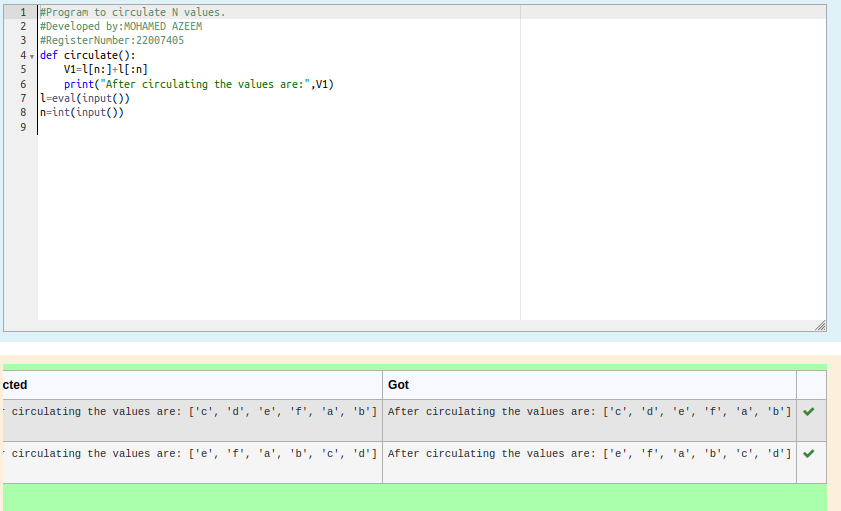

# Circulate-the-values-of-N-variables

## Aim:

To write a python program to circulate the n variables using function concept

## Equipment’s required:

PC
Anaconda - Python 3.7

## Algorithm: 

### Step 1: 

def the function using def command

### Step 2: 

get input from the user

### Step 3: 

Get the value from the user for the number of rotation

### Step 4: 

Using the slicing concept rotate the list

### Step 5: 

using print() display the output

### Step 6: 

End of the program

## Program:
```python
#Program to circulate N values.
#Developed by:MOHAMED AZEEM 
#RegisterNumber:22007405
def circulate():
    V1=l[n:]+l[:n]
    print("After circulating the values are:",V1)
l=eval(input())
n=int(input())
```

## Output:


## Result:
Thus circulate the values of n variables executed successfully